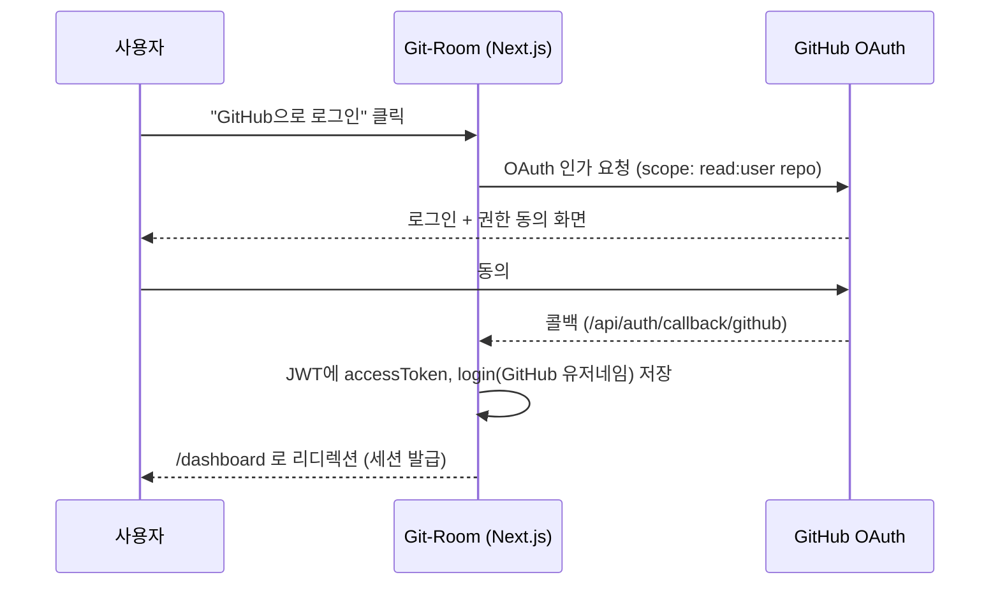

# 🧹 Git-Room 프로젝트 소개서

> 기획 배경, 기능 명세, 기술 구조를 한 문서에 정리합니다. 신규 합류자나 협업자가 이 문서 하나로 "왜 만들었고, 뭘 할 수 있고, 어떻게 동작하는지"를 파악할 수 있도록 하는 것이 목표입니다.

---

## 1. 한 줄 소개

**Git-Room은 "커밋을 안 하면 방이 더러워지는" GitHub 잔디 시각화 서비스입니다.**

로그인 없이도 쓸 수 있는 README 위젯과, 로그인 후 실제로 TIL을 커밋할 수 있는 웹 대시보드 두 가지 형태로 제공됩니다.

---

## 2. 기획

### 2.1 문제의식

기존 "잔디 시각화" 서비스들은 대부분 **캐릭터 성장형**입니다 — 커밋을 하면 캐릭터가 레벨업하거나 나무가 자라는 방식이죠. 이 방식은 "얻는 즐거움"으로 동기부여하지만, 하루 이틀 커밋을 건너뛰어도 캐릭터가 그 자리에 멈춰있을 뿐 별다른 불이익이 느껴지지 않습니다. 즉, **방치했을 때의 압박감이 약합니다.**

### 2.2 컨셉: 방치했을 때의 시각적 부채감

Git-Room은 반대 방향을 택했습니다. **평소엔 아무 변화가 없다가, 커밋을 안 하면 방이 점점 더러워집니다.**

| 미커밋 기간 | 방 상태 |
|---|---|
| 0일 (오늘 커밋함) | ✨ 깨끗한 방 |
| 1~2일 | 📄 종이 몇 장이 굴러다님 |
| 3~6일 | 🧹 쓰레기봉투 + 먼지 |
| 7일+ | 🕸️ 거미줄 + 꽉 찬 쓰레기통 + 어두운 방 |

"성장"이 아니라 **"방치의 티가 남"**을 시각화 축으로 잡았기 때문에, 사용자는 방을 다시 깨끗하게 만들기 위해 자연스럽게 커밋 동기를 얻습니다. 이는 습관 형성 앱들이 흔히 쓰는 "깨진 유리창 이론" — 지저분한 상태를 눈으로 보면 정리하고 싶어지는 심리 — 를 코딩 습관에 적용한 것입니다.

### 2.3 타겟 사용자

- 매일 조금씩이라도 배운 것을 기록/커밋하는 습관을 만들고 싶은 개발자
- 이미 TIL(Today I Learned) 레포를 운영 중이거나 시작하고 싶은 사람
- README에 "그냥 잔디 뱃지" 말고 조금 재밌는 위젯을 달고 싶은 사람

### 2.4 차별점 요약

1. **방치 페널티 중심**의 동기부여 (성장형이 아닌 퇴화형 시각화)
2. **로그인 없이도** 아무 GitHub 유저네임으로 즉시 체험 가능 (README 위젯)
3. 단순 시각화에 그치지 않고, **실제 커밋까지 대시보드 안에서 완결** (TIL 한 줄 커밋 + AI 문서화 커밋)

---

## 3. 기능

Git-Room은 크게 두 축 — **① README 위젯(비로그인)** 과 **② 웹 대시보드(로그인)** — 로 구성됩니다.

### 3.1 README 위젯 — `/api/room`

로그인 없이, 아무 GitHub 유저네임이나 넣으면 그 사람의 최근 커밋 상태를 반영한 방 SVG를 동적으로 그려줍니다.

```md

```

- GitHub의 **공개 잔디 그래프 HTML**을 서버에서 파싱해 "마지막 커밋 이후 며칠 지났는지"를 계산합니다. 별도 토큰이 필요 없어 누구나 자기 유저네임만으로 사용 가능합니다.
- 파싱에 실패해도(예: GitHub이 마크업을 바꿈) 에러 이미지 대신 **기본(깨끗한) 방 SVG로 안전하게 폴백**합니다. README에 깨진 이미지가 뜨는 것보다 낫다는 판단입니다.
- 응답에 캐시 헤더(`s-maxage=1800`)를 걸어 GitHub이 README 이미지를 너무 자주 재요청하지 않도록 했습니다.

### 3.2 웹 대시보드 — `/dashboard`

GitHub OAuth 로그인 후 접근하는 개인 페이지. 세 가지 카드로 구성됩니다.

#### ① 내 방 상태

로그인한 사용자의 **실제 커밋 잔디(GraphQL API 기반, 더 정확함)** 를 기준으로 방 SVG와 현재 연속 커밋일(스트릭)을 보여줍니다.

#### ② 오늘 배운 것 한 줄 (`TilForm`)

- 300자 이내 짧은 메모를 입력하면, `my-daily-learning`이라는 개인 TIL 레포의 `README.md` `## Log` 섹션에 **날짜와 함께 한 줄씩 누적 커밋**됩니다.
- 목적은 "매일 커밋해서 방을 청소하는 것" — 문서의 완성도보다 **꾸준함(스트릭)** 에 초점을 맞춘 가벼운 흐름입니다.
- 레포가 없으면 아래 ③번 기능으로 자동 생성 유도.

#### ③ AI로 깊게 정리하기 (`TilDocForm`) — 폴더별 문서화

한 줄 메모로는 부족할 때, AI가 이를 확장해서 **레포 안의 폴더 구조로 정리된 학습 문서**를 만들어주는 기능입니다. 2단계(생성 → 미리보기/수정 → 커밋)로 동작합니다.

1. 메모 입력 → "AI로 문서 만들기" 클릭
2. Google Gemini(`gemini-flash-lite-latest`)가 메모를 **배경 설명 + 핵심 개념 + 예시**를 포함한 마크다운 문서로 확장하고, 제목·파일명(kebab-case 슬러그)을 함께 생성
3. 미리보기 화면에서:
   - 저장할 **폴더**를 레포의 기존 폴더 목록에서 선택하거나, 새 폴더 이름을 직접 입력
   - **파일명**과 **본문**을 직접 수정 가능 (AI 생성 결과를 그대로 커밋하지 않고 검수 가능)
4. "커밋하기" → 레포의 `{폴더}/{파일명}.md`로 신규 파일 커밋

> 이 흐름은 ②번(한 줄 → README 누적)과 별개로 동작합니다. 짧고 빠른 스트릭용 커밋과, 깊이 있는 문서화용 커밋을 의도적으로 분리했습니다.

#### ④ TIL 레포 자동 생성 (`CreateRepoButton`)

`my-daily-learning` 레포가 없으면 버튼 한 번으로 생성합니다 (public, `auto_init`으로 README 생성 후 TIL 로그용 템플릿으로 초기화).

---

## 4. 기술 문서

### 4.1 기술 스택

| 영역 | 선택 |
|---|---|
| 프레임워크 | Next.js 14 (App Router) |
| 언어 | TypeScript |
| 인증 | NextAuth.js (`next-auth`) + GitHub OAuth Provider |
| GitHub API | `octokit` (Octokit REST + GraphQL) |
| AI (문서화) | Google Gemini API (`@google/genai`, 모델: `gemini-flash-lite-latest`) |
| 시각화 | 서버에서 직접 그리는 커스텀 SVG (`lib/room-svg.ts`) — 별도 이미지 에셋 없음 |
| 배포 대상 | Vercel (서버리스 함수 기반 API 라우트) |

### 4.2 프로젝트 구조

```
git-room/
  app/
    page.tsx                     # 랜딩 페이지 (로그인 + 위젯 사용법)
    dashboard/page.tsx           # 로그인 후 대시보드
    api/
      room/route.ts              # GET  /api/room?user=xxx        → 공개 README 뱃지
      auth/[...nextauth]/        # GitHub OAuth 콜백
      til/route.ts               # POST /api/til                  → 한 줄 TIL → README 로그 커밋
      til/folders/route.ts       # GET  /api/til/folders           → 레포 폴더 목록 조회
      til/generate/route.ts      # POST /api/til/generate          → AI로 문서 초안 생성 (커밋 X)
      til/commit/route.ts        # POST /api/til/commit            → 폴더 선택 후 새 파일 커밋
      create-repo/route.ts       # POST /api/create-repo           → TIL 레포 자동 생성
  lib/
    auth.ts                      # NextAuth 설정 (GitHub scope: read:user repo)
    github.ts                    # Octokit 기반 레포 생성 · 폴더 조회 · 파일 커밋 로직
    gemini.ts                    # Gemini 구조화 출력으로 TIL 문서 생성
    contributions.ts             # 잔디 데이터 조회 (공개 스크래핑 / GraphQL)
    room-svg.ts                  # 방치 단계별 방 SVG 렌더러
  components/                    # 클라이언트 UI (TilForm, TilDocForm, RoomView, ...)
```

### 4.3 인증 흐름



- `lib/auth.ts`의 `jwt` / `session` 콜백에서 GitHub `access_token`과 `login`을 세션에 실어, 이후 모든 API 라우트가 `getServerSession()`만으로 Octokit 인증 토큰을 바로 꺼내 쓸 수 있게 합니다.
- scope는 `read:user repo` — 대시보드에서 TIL 레포를 **생성·커밋**해야 하므로 `repo` 권한이 필요합니다. (공개 레포만 다룰 경우 `public_repo`로 좁힐 수 있음)

### 4.4 AI 문서화 흐름

```mermaid
flowchart LR
    A[사용자 메모 입력] --> B["POST /api/til/generate"]
    B --> C[Gemini: 구조화 출력\ntitle / fileName / body]
    C --> D[클라이언트 미리보기\n폴더 선택·파일명·본문 수정 가능]
    D --> E["GET /api/til/folders\n(레포 폴더 목록, 최초 진입 시)"]
    D --> F["POST /api/til/commit"]
    F --> G[Octokit: createOrUpdateFileContents\n{folder}/{fileName}.md]
    G --> H[GitHub 레포에 신규 파일 커밋]
```

- **생성과 커밋을 분리한 이유**: AI가 만든 내용을 검수 없이 바로 레포에 커밋하는 것은 리스크가 있다고 판단해, `/generate`(미리보기 생성)와 `/commit`(실제 커밋)을 별도 API로 나눴습니다.
- **구조화 출력**: `responseMimeType: application/json` + `responseSchema`로 `{ title, fileName, body }` 형태를 강제해 파싱 실패 가능성을 없앴습니다.
- **폴더 목록 조회**: `git.getTree({ recursive: "true" })`로 레포 전체 트리를 한 번에 가져와 폴더(`type: "tree"`) 경로만 추출합니다. 레포가 아직 없으면 빈 배열을 반환해 "새 폴더 만들기"부터 시작할 수 있게 합니다.
- **경로 안전성**: 커밋 API에서 사용자가 입력한 `folder`/`fileName`은 `..`, 빈 세그먼트 등을 제거하는 `sanitizePathSegment()`를 거쳐 GitHub API 경로로 사용됩니다.

### 4.5 주요 API 엔드포인트

| Method | Path | 인증 | 설명 |
|---|---|---|---|
| GET | `/api/room?user=` | 불필요 | 공개 README 위젯 SVG |
| POST | `/api/til` | 필요 | 한 줄 TIL → `README.md` 로그 커밋 |
| GET | `/api/til/folders` | 필요 | TIL 레포의 폴더 목록 조회 |
| POST | `/api/til/generate` | 필요 | AI로 문서 초안 생성 (커밋 안 함) |
| POST | `/api/til/commit` | 필요 | 선택한 폴더/파일명으로 신규 문서 커밋 |
| POST | `/api/create-repo` | 필요 | `my-daily-learning` 레포 자동 생성 |
| * | `/api/auth/[...nextauth]` | - | GitHub OAuth 로그인/콜백/로그아웃 |

### 4.6 환경 변수

| 변수 | 용도 |
|---|---|
| `GITHUB_ID` / `GITHUB_SECRET` | GitHub OAuth App 자격 증명 |
| `NEXTAUTH_SECRET` | NextAuth 세션/JWT 암호화 키 |
| `NEXTAUTH_URL` | 배포 도메인 (콜백 URL 계산용) |
| `GEMINI_API_KEY` | AI 문서화 기능(Gemini API) 사용 |

### 4.7 방 상태 렌더링 방식

`lib/room-svg.ts`가 미커밋 일수를 4단계(`clean`/`light`/`moderate`/`neglected`)로 나누고, 단계별로:
- 벽/바닥 팔레트를 점점 어둡게
- 구겨진 종이 → 쓰레기봉투 → 꽉 찬 쓰레기통 + 거미줄 + 연기 순으로 오브젝트 추가
- 먼지 레이어(`mix-blend-mode: multiply`)와 암전 오버레이로 "방치감"을 누적

별도 이미지 에셋 없이 순수 SVG 문자열 조합으로 렌더링하기 때문에, 서버리스 환경에서도 가볍고 빠릅니다.

---

## 5. 알려진 제한 사항

- `/api/room`은 GitHub의 **비공식 공개 HTML 마크업**을 파싱합니다. GitHub이 마크업을 바꾸면 깨질 수 있어 실패 시 기본(깨끗한) 방으로 폴백하도록 처리했지만, 프로덕션에서는 GitHub GraphQL API + 서버 보관용 토큰 방식으로 교체하는 것을 권장합니다.
- 방 그래픽은 SVG 도형으로 직접 그린 플레이스홀더 아트입니다. 실제 픽셀아트 에셋으로 교체하려면 `renderRoomSVG` 내부 레이어를 이미지 스프라이트 합성 방식으로 바꾸면 됩니다.
- AI 문서화 기능은 Gemini API 키가 없으면 동작하지 않습니다(다른 기능에는 영향 없음).
- 잔디 반영은 GitHub 특성상 커밋 직후 바로 방 상태에 반영되지 않고 몇 분 정도 지연될 수 있습니다.

## 6. 다음 스텝 후보

- README 위젯을 공식 GraphQL API 기반으로 전환
- 방 그래픽 픽셀아트 에셋화
- AI 문서화 시 태그/검색, 기존 파일에 이어쓰기(수정) 지원
- TIL 문서 커밋에도 스트릭 반영 (현재는 GitHub 전체 잔디 기준이라 자동으로 반영되긴 함)
